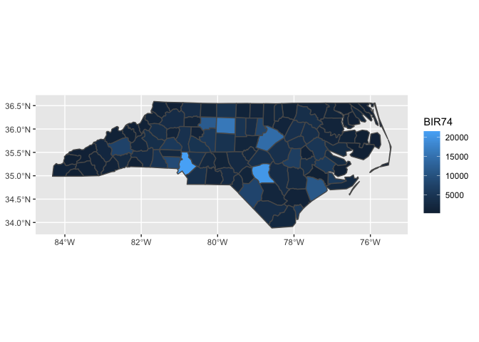
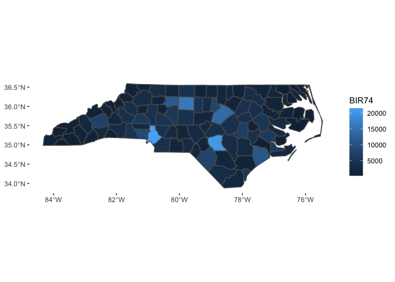

<!-- README.md is generated from README.Rmd. Please edit that file -->

<!-- badges: start -->

[](https://github.com/jayrobwilliams/RWmisc/actions)
[](https://codecov.io/gh/jayrobwilliams/RWmisc)
[](http://www.gnu.org/licenses/gpl-3.0.html)
<!-- badges: end -->

# RWmisc

This package contains convenience functions I have written to help deal
with spatial data spread across multiple UTM zones and aggregating
raster data to overlapping polygons.

# Installation

You can install the latest development version from GitHub with:

``` r
# install.packages("devtools")
remotes::install_github("jayrobwilliams/RWmisc")
```

# Examples

The functions contained in this package serve to make working with
spatial data on large scale easy, as when carrying out cross-national
analyses with spatial data. The function `projectUTM` can project `sf`
and `sp` objects in latitude, longitude coordinate reference systems,
and can even re-project already-projected objects in other projected
coordinate reference systems.

``` r
library(sf)
#> Linking to GEOS 3.8.1, GDAL 3.1.4, PROJ 6.3.1

library(RWmisc)

nc <- st_read(system.file("shape/nc.shp", package="sf"))
#> Reading layer `nc' from data source `/Library/Frameworks/R.framework/Versions/4.0/Resources/library/sf/shape/nc.shp' using driver `ESRI Shapefile'
#> Simple feature collection with 100 features and 14 fields
#> geometry type:  MULTIPOLYGON
#> dimension:      XY
#> bbox:           xmin: -84.32385 ymin: 33.88199 xmax: -75.45698 ymax: 36.58965
#> geographic CRS: NAD27

projectUTM(nc)
#> Simple feature collection with 100 features and 14 fields
#> geometry type:  MULTIPOLYGON
#> dimension:      XY
#> bbox:           xmin: 196602 ymin: 3751723 xmax: 1002267 ymax: 4057841
#> CRS:            +proj=utm +zone=17
#> First 10 features:
#>     AREA PERIMETER CNTY_ CNTY_ID        NAME  FIPS FIPSNO CRESS_ID BIR74 SID74
#> 1  0.114     1.442  1825    1825        Ashe 37009  37009        5  1091     1
#> 2  0.061     1.231  1827    1827   Alleghany 37005  37005        3   487     0
#> 3  0.143     1.630  1828    1828       Surry 37171  37171       86  3188     5
#> 4  0.070     2.968  1831    1831   Currituck 37053  37053       27   508     1
#> 5  0.153     2.206  1832    1832 Northampton 37131  37131       66  1421     9
#> 6  0.097     1.670  1833    1833    Hertford 37091  37091       46  1452     7
#> 7  0.062     1.547  1834    1834      Camden 37029  37029       15   286     0
#> 8  0.091     1.284  1835    1835       Gates 37073  37073       37   420     0
#> 9  0.118     1.421  1836    1836      Warren 37185  37185       93   968     4
#> 10 0.124     1.428  1837    1837      Stokes 37169  37169       85  1612     1
#>    NWBIR74 BIR79 SID79 NWBIR79                       geometry
#> 1       10  1364     0      19 MULTIPOLYGON (((457533.8 40...
#> 2       10   542     3      12 MULTIPOLYGON (((478495.8 40...
#> 3      208  3616     6     260 MULTIPOLYGON (((548866.7 40...
#> 4      123   830     2     145 MULTIPOLYGON (((948208.3 40...
#> 5     1066  1606     3    1197 MULTIPOLYGON (((839954.7 40...
#> 6      954  1838     5    1237 MULTIPOLYGON (((882486.8 40...
#> 7      115   350     2     139 MULTIPOLYGON (((948208.3 40...
#> 8      254   594     2     371 MULTIPOLYGON (((898362.4 40...
#> 9      748  1190     2     844 MULTIPOLYGON (((741807.4 40...
#> 10     160  2038     5     176 MULTIPOLYGON (((587556.5 40...
```

The `theme_rw` function is the minimalist theme I often use for figure
in my work. While it is useful for standard plots, it is an especially
large improvement over the `ggplot2` defaults for maps.

``` r
library(ggplot2)

ggplot(aes(fill = BIR74), data = nc) +
  geom_sf()

ggplot(aes(fill = BIR74), data = nc) +
  geom_sf() +
  theme_rw()
```


